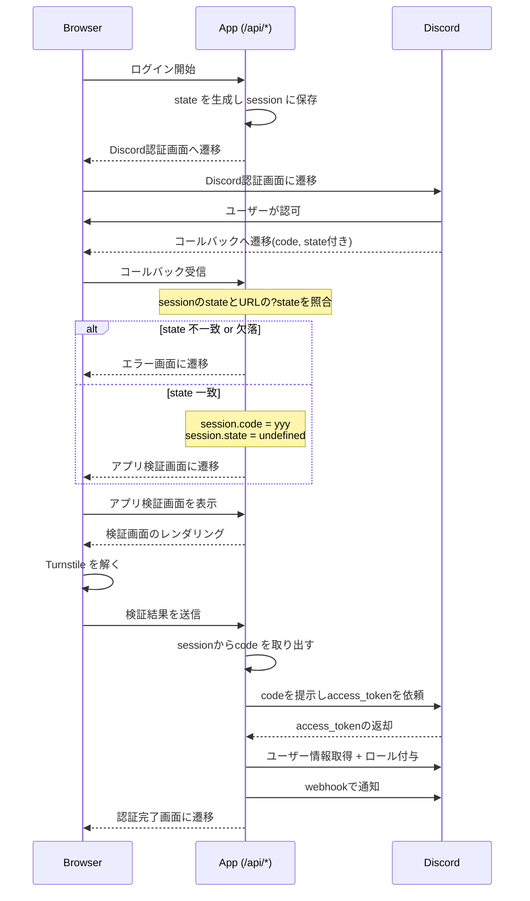

# はじめに

本記事では Next.js, Discord の Oauth2 を組み合わせて Discord サーバーに認証パネルを追加する方法を共有します。

ソースコードは以下のリポジトリで公開しています。
https://github.com/proto08/discord-verify

## 認証システムの主な動作フロー



## Cloudflare Turnstile とは

Cloudflare Turnstile は、以下の画像のようなチェックボックス型のボット対策サービスです。


面倒な画像認証を解く必要がなく、チェックボックスをクリックするだけでボットかどうかを判定できます

:::message
キャプチャを自動的に突破するサービス([capsolver](https://www.capsolver.com/), [capmonster](https://capmonster.cloud/en)`など)が存在します。
Turnstile は突破するのが難しいらしく、reCAPTCHA や hCaptcha よりも自動解決のコストが高いです。

ユーザー体験の観点からも Turnsitle の使用をお勧めします。
:::

# 環境構築

## Bun を入れよう(布教)

パッケージマネージャーには`bun`を使用します。
`pnpm`や`npm`よりも高速でお勧めです。

```bash:macos&linux
curl -fsSL https://bun.com/install | bash
```

```bash:windows
powershell -c "irm bun.sh/install.ps1|iex"
```

https://bun.com/docs/installation

## Next.js の初期化

```bash
bun create next-app@latest discord-auth \
  --typescript --eslint --tailwind --app --import-alias "@/*" --use-turbopack

cd discord-auth
```

## パッケージのインストール

### swr

```bash
bun add swr
```

data fetch 用のライブラリです。
キャッシュやリアルタイム通信を簡単に実装できます。

https://swr.vercel.app/

### formik

form ライブラリです。
データの送信に使います。

```bash
bun add formik
```

https://formik.org/

### iron-session

```bash
bun add iron-session
```

`iron-session` は Cookie を利用したセッション管理ライブラリです。
保存されるデータは `AES-256-CBC` で暗号化されます。
詳しくは以下の記事が参考になります。  
https://qiita.com/aurora1530/items/015cdef0fc9c8033c949

### next-turnstile

```bash
bun add next-turnstile
```

Cloufdlare Turnstile のために導入します。
https://github.com/JedPattersonn/next-turnstile

### shadcn/ui

```bash
bunx --bun shadcn@latest init
bunx --bun shadcn@latest add button
```

`shadcn/ui` はモダンで美しい UI コンポーネントを提供するライブラリです。今回は Button コンポーネントを使用します。  
https://ui.shadcn.com/docs/installation/next

# 事前準備

## Discord Developer Portal

Discord Developer Portal で Bot を作成してください。

1. 「OAuth 2」の「Redirects」に `https://localhost:3000/api/callback` を入力
2. `CLIENT_ID` と `CLIENT_SECRET` を控えておく

認可 URL は「OAuth 2 URL Generator」で生成した固定リンクを使い回すのではなく、後述する `/api/login` でリクエストごとにアプリ側が生成します。固定リンクを直貼りすると `state` を仕込めず CSRF に弱くなるためです。  
https://discord.com/developers/applications

## 環境変数の設定

プロジェクトのルートディレクトリに `.env` ファイルを作成し、以下の環境変数を設定してください。

```env:.env
# Discord OAuth2
CLIENT_ID=              # Discord Developer Portal から取得
CLIENT_SECRET=          # 同上
BASE_URL=http://localhost:3000 # でで

# Discord サーバー
DISCORD_GUILD_ID=       # 対象サーバーの ID
DISCORD_ROLE_ID=        # 認証成功時に付与するロール ID
DISCORD_BOT_TOKEN=      # Bot トークン
DISCORD_WEBHOOK=        # 認証ログ用 Webhook URL

# Cloudflare Turnstile
NEXT_PUBLIC_TURNSTILE_SITE_KEY=  # Cloudflare ダッシュボードから取得
TURNSTILE_SECRET_KEY=            # 同上

# Session
SESSION_PASSWORD=                # `bunx auth secret`
```

:::message
Discord Webhook の作成方法：

1. Discord サーバーの設定を開く
2. 「連携サービス」→「ウェブフック」を選択
3. 「新しいウェブフック」をクリック
4. 生成された URL を `DISCORD_WEBHOOK` に設定

**※ Webhook URL は機密情報です。第三者に共有しないよう注意してください。**
:::

## Cloudflare Turnstile の設定

1. [Cloudflare ダッシュボード](https://dash.cloudflare.com/) にアクセス
2. 「Turnstile」を選択
3. 「Add Widget」をクリック
4. 以下を設定：
   - Widget name: 任意
   - Add Hostnames: `localhost:3000`（開発環境の場合）
5. 「Create」をクリック
6. 表示された Site Key と Secret Key を環境変数へ設定

# 実装

## セッションの作成

```ts:services/session.ts
export const sessionOptions: SessionOptions = {
  password: process.env.SESSION_PASSWORD!,
  cookieName: 'verify',
  cookieOptions: {
    secure: process.env.NODE_ENV === 'production',
    httpOnly: true,
    sameSite: 'lax',
    path: '/',
    maxAge: 60 * 60,
  },
}
```

`iron-session` を用いてセッションを設定します。

### password

セッションの暗号化に使用します。

### secure

cookie の送信が暗号化された通信(HTTPS)に限定されます。

`process.env.NODE_ENV === "production"` とすることで、開発環境で使用できるようにします。

### httpOnly

Javascript から cookie にアクセスできないようにします。

例:

```js
alert(document.cookie);
```

### sameSite

strict
同一サイトからのリクエストのみ Cookie を送信します。
| リクエスト元 | リクエスト先 | GET | POST | リンク |
| --- | --- | --- | --- | --- |
| orign.com | target.com | ❌ | ❌ | ❌ |

lax（今回使用）
外部サイトからの POST 以外で Cookie を送信します。
| リクエスト元 | リクエスト先 | GET | POST | リンク |
| --- | --- | --- | --- | --- |
|origin.com | target.com | ✅ | ❌ | ✅ |

none（非推奨）
すべてのリクエストで Cookie を送信します。
| リクエスト元 | リクエスト先 | GET | POST | リンク |
| --- | --- | --- | --- | --- |
| origin.com | targe.com | ✅ | ✅ | ✅ |

`/api/callback` は Discord からのリダイレクトで戻ってくるので、Discord から見ればクロスサイトのトップレベル遷移になります。`strict` にするとこの遷移で Cookie が送られず、後述する `state` の検証ができません。かといって `none` は無関係なサイトからの POST にも Cookie が付いてしまうため、 `lax` を使います。

## 認可 URL の生成

Discord の認可 URL を毎回動的に生成し、`state` を発行して session に保存してからリダイレクトします。

```ts:app/api/login/route.ts
export async function GET(req: NextRequest) {
  const res = new NextResponse()
  const session = await getIronSession<SessionData>(req, res, sessionOptions)

  const state = crypto.randomBytes(32).toString('hex')
  session.state = state
  await session.save()

  const authorizeUrl = new URL('https://discord.com/oauth2/authorize')
  authorizeUrl.searchParams.set('client_id', process.env.CLIENT_ID ?? '')
  authorizeUrl.searchParams.set('response_type', 'code')
  authorizeUrl.searchParams.set('redirect_uri', `${process.env.BASE_URL}/api/callback`)
  authorizeUrl.searchParams.set('scope', 'identify')
  authorizeUrl.searchParams.set('state', state)

  return NextResponse.redirect(authorizeUrl, { headers: res.headers })
}
```

サーバー側で発行した`state`は、この後 Discord から返ってくる`state`と突き合わせて、`/api/callback`が正規の認可リクエストへの応答であることを確認するために使います。認証ボタン(リンク)は Discord の URL に直接ではなく、この`/api/login`に向けてください。

## callback 処理

```ts:app/api/callback/route.ts
export async function GET(req: NextRequest) {
  const res = new NextResponse()
  try {
    const session = await getIronSession<SessionData>(req, res, sessionOptions)
    const code = req.nextUrl.searchParams.get('code')
    const state = req.nextUrl.searchParams.get('state')

    if (!code || !state || !session.state || state !== session.state) {
      session.state = undefined
      await session.save()
      return NextResponse.redirect(new URL('/verify/error', process.env.BASE_URL), {
        headers: res.headers,
      })
    }

    session.code = code
    session.state = undefined
    await session.save()

    return NextResponse.redirect(new URL('/verify', process.env.BASE_URL), {
      headers: res.headers,
    })
  } catch (error) {
    console.error('Error in api/callback:', error)
    return NextResponse.redirect(new URL('/verify/error', process.env.BASE_URL))
  }
}
```

Discord での認可が終わると、指定した callback に`code`と`state`パラメータを付与してリダイレクトされます。

まず`state`が session に保存しておいたものと一致するか確認します。一致しなければ、この`code`は自分が発行した認可リクエストに対応するものではないと判断してエラー画面に飛ばします。一致すれば`code`を`iron-session`で暗号化して`cookie`にセットし、`/verify`にリダイレクトします。


## 送信用 Hooks の作成

```ts:services/hooks/verify-hooks.ts
'use client'

interface UseVerify {
  formik: FormikProps<FormValues>
}

interface FormValues {
  token: string
}

export function useVerify(): UseVerify {
  const router = useRouter()
  const verify = async (url: string, { arg }: { arg: FormValues }) => {
    const response = await fetch(url, {
      method: 'POST',
      headers: {
        'Content-Type': 'application/json',
      },
      body: JSON.stringify({ token: arg.token }),
    })
    if (!response.ok) {
      router.push('/error')
    }
    return response.json()
  }

  const { trigger } = useSWRMutation('/api/verify', verify)
  return { formik }
}

```

引数`url`に`POST`リクエストを送る`verify`関数を定義し、
`useSWRMutation`を使用して`trigger`関数を取得します。

`useSWRMutation`は、データ変更用の hooks で、trigger 関数を呼び出すことで任意のタイミングで実行できます。（`await trigger(value)`をするだけ)

通常の`useSWR`がデータの取得に特化しているのに対し、`useSWRMutation`はデータの変更操作に特化しています。
https://swr.vercel.app/ja/docs/mutation

```ts:services/hooks/verify-hooks.ts
  const formik = useFormik<FormValues>({
    initialValues: {
      token: '',
    },
    validationSchema: yup.object({
      token: yup.string().required(),
    }),
    onSubmit: async values => {
      try {
        console.log('Submitting values:', values)
        await trigger(values)
        router.push('/success')
      } catch (error) {
        console.error('Verify error:', error)
        router.push('/error')
      }
    },
  })
  return { formik }
```

`useFormik`でフォームの状態管理を行います。

- `initialValues`: フォームの初期値
- `validationSchema`: yup を使用してバリデーションルールを定義します。
- `onSubmit`: フォーム送信時に実行される処理です。`trigger`関数を呼び出しています。

`formik`の`onSubmit`で`trigger`関数を呼び出すことで、フォーム送信時に`verify`関数が実行され、Turnstile トークンが`/api/verify`に送信されます。

## Turnstile トークンの検証

ユーザーから送信された`token`を Cloudflare の api に送信して検証します。

```ts:services/validate-turnstile.ts
export async function validateToken(token: string) {
  try {
    const response = await fetch(
      'https://challenges.cloudflare.com/turnstile/v0/siteverify',
      {
        method: 'POST',
        headers: {
          'Content-Type': 'application/json',
        },
        body: JSON.stringify({
          secret: process.env.TURNSTILE_SECRET_KEY as string,
          response: token,
        }),
      }
    )

    if (!response.ok) {
      throw new Error('Failed to verify token')
    }

    return await response.json()
  } catch (error) {
    console.log('Error in verify csrf token:', error)
    throw error
  }
}
```

## ユーザー情報の取得

### アクセストークンの取得

`code`を用いてアクセストークンを取得する必要があります。

```ts:services/discord/verify.ts
export async function getAccessToken(code: string) {
  try {
    const body = new URLSearchParams({
      grant_type: 'authorization_code',
      code: code,
      redirect_uri: `${process.env.BASE_URL}/api/callback`,
    }).toString()

    const reponse = await fetch(`https://discord.com/api/v10/oauth2/token`, {
      method: 'POST',
      headers: {
        'Content-Type': 'application/x-www-form-urlencoded',
        Authorization:
          'Basic ' +
          Buffer.from(
            `${process.env.CLIENT_ID}:${process.env.CLIENT_SECRET}`
          ).toString('base64'),
      },
      body: body,
    })

    if (!reponse.ok) {
      throw new Error('Failed to fetch token')
    }

    return await reponse.json()
  } catch (error) {
    console.log('Error in get token from discord:', error)
    throw error
  }
}
```

### ユーザー情報の取得

まずは User 情報の型を作ってあげましょう。
これはアクセストークンを discord api に投げた時の返り値の型です。

```ts:entities/user.ts
export interface User {
  id: number
  username: string
  global_name: string
  avatar_id: string
  locale: string
  mfa_enabled: boolean
}
```

discord api に投げる部分を作ります。

```ts:services

export async function getInfo(accessToken: string): Promise<User> {
  try {
    const res = await fetch(`https://discord.com/api/users/@me`, {
      method: 'GET',
      headers: {
        Authorization: `Bearer ${accessToken}`,
      },
    })

    if (!res.ok) {
      throw new Error(`Failed to fetch user info: ${res.status}`)
    }

    const userInfo = await res.json()
    return userInfo
  } catch (error) {
    console.log('Error in getInfo:', error)
    throw error
  }
}

```

## ロールの付与

ユーザー情報を取得できたので、そのユーザーに認証済みロールを付与します。

```ts:services/discord/assing-role.ts
export async function assignRole(userId: string) {
  try {
    const guildId = process.env.DISCORD_GUILD_ID
    const roleId = process.env.DISCORD_ROLE_ID
    const botToken = process.env.DISCORD_BOT_TOKEN

    const response = await fetch(
      `https://discord.com/api/v10/guilds/${guildId}/members/${userId}/roles/${roleId}`,
      {
        method: 'PUT',
        headers: {
          Authorization: `Bot ${botToken}`,
          'Content-Type': 'application/json',
        },
      }
    )

    if (!response.ok) {
      throw new Error(`Failed to assign role: ${response.status}`)
    }
  } catch (error) {
    console.log('Error in assign role:', error)
    throw error
  }
}
```

## IP アドレスから情報を取得

IP アドレスから大体の地域や使っているプロバイダーを取得できます。

VPN や Tor の検知に有効です。

まずは型を定義します。

```ts:entities/logger.ts
export interface IpInfo {
  ip: string
  city: string
  region: string
  country: string
  loc: string
  org: string
  postal: string
}
```

api には[ipinfo.io](https://ipinfo.io)を使用します。

```ts:services/get-user-info.ts
export async function getIpInfo(ip: string): Promise<IpInfo> {
  try {
    const response = await fetch(`https://ipinfo.io/${ip}/json`)

    if (!response.ok) {
      throw new Error(`Failed to fetch IP info: ${response.status}`)
    }

    return await response.json()
  } catch (error) {
    console.log('Error in getIpInfo:', error)
    throw error
  }
}
```

## VPN の検知

詳しくはこちらをご覧ください。
https://zenn.dev/64919/articles/fbed045a7b8696

## 認証ログの送信

取得したユーザー情報、IP アドレス情報、UserAgent を指定した WEBHOOK に送信します。

https://github.com/proto08/discord-verify/blob/main/src/services/discord/logger.ts

この関数は、認証成功時に Discord Webhook を使用してログを送信します。
アクセストークンから取得した情報を使用しています。

## 検証 API の作成

https://github.com/proto08/discord-verify/blob/main/src/app/api/verify/route.ts

この API は以下の手順で認証を処理します：

1. Turnstile トークンの検証
2. ユーザー情報の取得
3. IP アドレスの取得 + VPN チェック
4. ロールの付与
5. ログの送信

## error/success ページの作成

```ts:app/success/page.tsx
export default function Page() {
    return (
        <main className="flex min-h-screen items-center justify-center">
            <div className="p-10 rounded-4xl md:w-1/2 max-w-md border border-white/[0.10]">
                <div className="mx-auto">
                    <h1 className="text-xl font-bold mb-4 text-center">認証が完了しました</h1>
                    <p className="text-center text-muted-foreground mb-6">
                        認証が正常に完了しました。このページは閉じて構いません。
                    </p>
                </div>
            </div>
        </main>
    )
}
```

```ts:app/error/page.tsx
export default function Page() {
    return (
        <main className="flex min-h-screen items-center justify-center">
            <div className="p-10 rounded-4xl md:w-1/2 max-w-md border border-white/[0.10]">
                <div className="mx-auto">
                    <h1 className="text-xl font-bold mb-4 text-center">エラーが発生しました</h1>
                    <p className="text-center text-muted-foreground mb-6">
                        認証処理中にエラーが発生しました。もう一度お試しください。
                    </p>
                </div>
            </div>
        </main>
    )
}
```

お好みでスタイリングして下さい。


## まとめ

本稿では、Discord OAuth 2 と Cloudflare Turnstile を組み合わせたセキュアな Web 認証アプリの作り方を紹介しました。

バックアップ BOT の作成など、様々なことに応用出来ると思いますので、気になる方は試してみて下さい。
